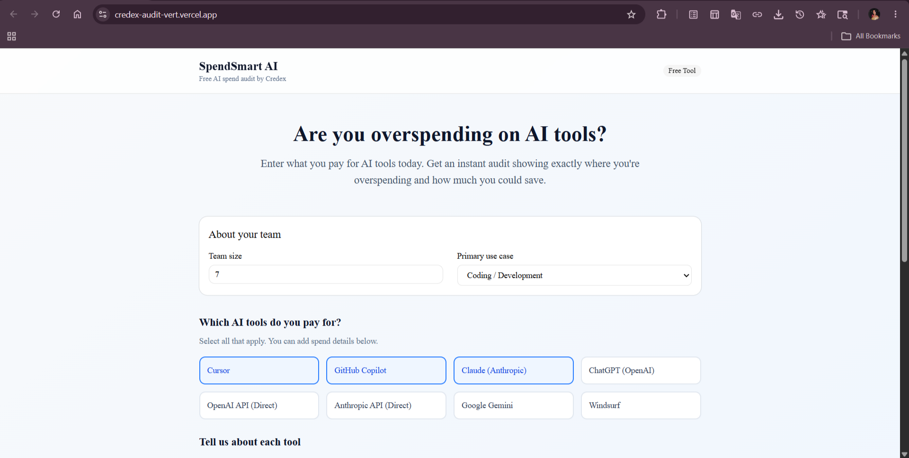
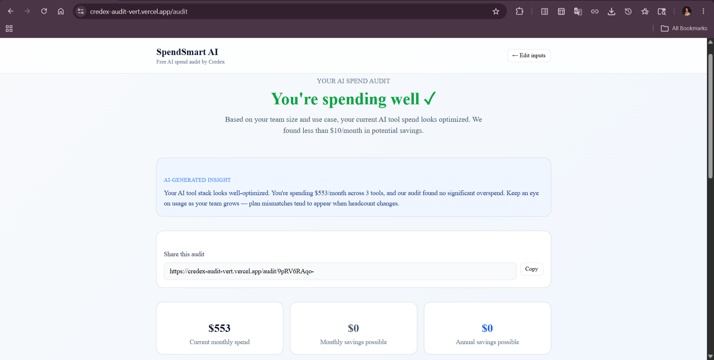

# SpendSmart AI — Free AI Spend Audit Tool

A free web app that helps startup founders and engineering managers audit their AI tool spend, identify overspending, and get actionable recommendations to save money. Built as a lead-generation asset for [Credex](https://credex.rocks).

**Live URL:** https://credex-audit-wges.vercel.app

---

## Screenshots


### Spend Input Form


### Audit Results


## Quick Start

### Run locally

```bash
git clone https://github.com/khmkdh/credex-audit.git
cd credex-audit
npm install
cp .env.local.example .env.local  # fill in your keys
npm run dev
```

Open http://localhost:3000

### Environment variables

| Variable | Description |
|---|---|
| `GEMINI_API_KEY` | Google Gemini API key for AI summaries |
| `NEXT_PUBLIC_SUPABASE_URL` | Supabase project URL |
| `NEXT_PUBLIC_SUPABASE_ANON_KEY` | Supabase anon key |
| `SUPABASE_SERVICE_ROLE_KEY` | Supabase service role key |
| `RESEND_API_KEY` | Resend API key for transactional email |
| `NEXT_PUBLIC_BASE_URL` | Your deployed URL |

### Deploy

```bash
# Push to main — Vercel auto-deploys
git push origin main
```

---

## Decisions

1. **Next.js App Router over Pages Router** — App Router enables React Server Components and native support for async params in dynamic routes, which simplified the shareable URL implementation. Trade-off: steeper learning curve for a first Next.js project.

2. **Hardcoded audit rules over ML/AI** — The audit engine uses deterministic rules rather than AI inference. This makes the logic auditable, debuggable, and defensible to a finance person. AI is only used for the summary paragraph where natural language adds value.

3. **Gemini over Anthropic API** — Anthropic's console required a payment method with no free tier bypass. Gemini's free tier (1,500 requests/day) is more than sufficient for this use case and the assignment explicitly permits any LLM.

4. **Supabase over a custom Postgres** — Supabase gives a managed Postgres with a REST API, auth, and RLS out of the box. For a 7-day build, this saved significant setup time. Trade-off: vendor lock-in.

5. **Email gate after results, never before** — Showing value before asking for email dramatically increases conversion. Users who see their savings number are far more motivated to share their email than users who hit a gate before seeing anything.

---

## Tech Stack

- **Framework:** Next.js 16 (App Router) + TypeScript
- **Styling:** Tailwind CSS + shadcn/ui
- **Database:** Supabase (Postgres)
- **Email:** Resend
- **AI:** Google Gemini 1.5 Flash
- **Deploy:** Vercel
- **Tests:** Jest + ts-jest